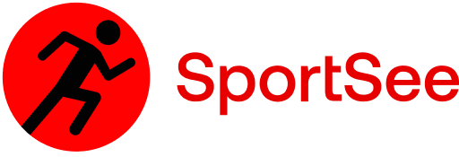

# 

## 1. General information

This repository contains the Front-End Dashboard of the Sportsee application.

## 2. Project

### 2.1 Prerequisites

-  [Yarn](https://yarnpkg.com/)
-  [Git](https://git-scm.com/)

### 2.2 Dependencies

-  [React](https://reactjs.org/) v18.2.34
-  [react-router-dom](https://reactrouter.com/web/guides/quick-start) v6.17.0
-  [recharts](https://recharts.org/en-US) v2.9.2

### 2.2 Launching the project

-  Clone the repository

   `https://github.com/kharoncode/OC-P12.git`

-  Move to the folder

   `cd OC-P12`

-  Install the package

   `yarn`

-  Run the project (Port 3001)

   `yarn start`

## 3. BackEnd

### 2.1 Prerequisites

-  [NodeJS (**version 12.18**)]

If you are working with several versions of NodeJS, we recommend you install [nvm](https://github.com/nvm-sh/nvm). This tool will allow you to easily manage your NodeJS versions.

### 2.2 Lauching the BackEnd

-  Clone the repository

   `https://github.com/OpenClassrooms-Student-Center/P9-front-end-dashboard.git`

-  Move to the folder

   `cd P9-front-end-dashboard`

-  Install the package

   `yarn`

-  Run the micro API (Port 3000)

   `yarn dev`

## 4. Endpoints

On the main page `http://localhost:3001/` you can choose between two users **12** and **18** and whether you want to use the mocked data or data from API
